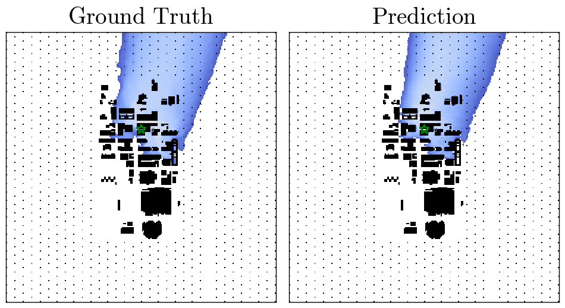
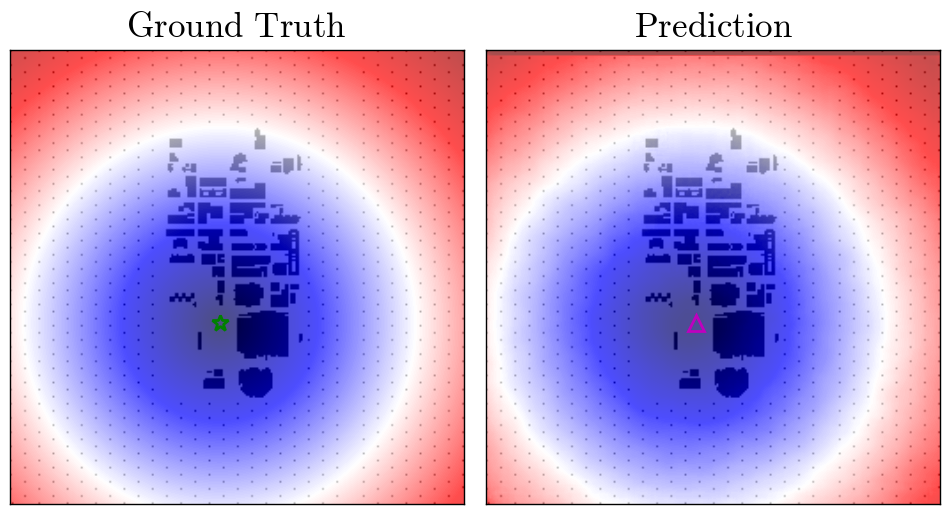

# CityTransformer

[_CityTransformer_](https://doi.org/10.1007/s10546-022-00777-8) is designed to predict the plume concentrations in the urban area under uniform flow condition.
It has two distinct input layers: Transformer layers for time series data and convolutional layers for image-like data.
The inputs of the network are realistically available data such as the the building shapes and source locations, and time series monitoring data at a few observation stations. 

This network can be used to predict the plume concentration and source location (inverse problem). In the inverse problem, the location where the distance function is closest to zero is considered as the predicted source location. Following table summarizes the choice of input and output data for each task. The examples of predictions are also shown. 

For questions or comments, please find us in [AUTHORS](AUTHORS).

| Task | Input data | Output data | Example | 
| --- | --- | --- | --- |
| Plume prediction | 1. Monitoring time series data <br> 2. Buliding height <br> 3. Distance function of sources | 1. Plume concentration <br> 2. Binary representation of plume |  |
| Source detection | 1. Monitoring time series data <br> 2. Buliding height | 1. Distance function of sources <br> 2. Source strength |  |

# Usage

## Installation
This code relies on the following packages. As a deeplearing framework, we use [PyTorch](https://pytorch.org).
- Install Python libraries
[numpy](https://numpy.org), [PyTorch](https://pytorch.org), [xarray](http://xarray.pydata.org/en/stable/), [horovod](https://github.com/horovod/horovod) and [netcdf4](https://github.com/Unidata/netcdf4-python)

- Clone this repo  
```git clone https://github.com/yasahi-hpc/CityTransformer.git```

## Prepare dataset
The urban plume dispersion dataset for CityTransformer has been computed by the [CityLBM](https://doi.org/10.1007/s10546-020-00594-x) code. The dataset can be downloaded from [Dataset (35000 training data, 2500 validation, and 2500 test data)](https://doi.org/10.5281/zenodo.7523682). We simulate a 4km x 4km x 2.5km area of Oklahoma city under the uniform flow conditions. In each simulation, 25 tracer particles are released from random locations in the city center. We consider three distinct 1.5 hour long time windows for data augumentation. A single file `shot#.nc` includes the two dimensional levelset function (`levelset`), two dimensional distance function from a source location (`release_point`), time-averaged two dimensional plume concentration on the ground (`log_concentration_map`), and its binary representation (`concentration_binary_map`) as image-like data. In addition, each file includes the time-varying vertical profiles of flow velocities  and , and the ground level plume concentration  (`concentration`) and  (`log_concentration`) from 14 monitoring stations. The data is stored in the following format. In addition, we provide the precomputed normalization coefficients in a netcdf file, `stats.nc`. For the inverse problem, we use the precomputed random numbers in `random_numbers.nc` to augment the source strength.
```
<xarray.Dataset>
Dimensions:                   (time: 60, station: 14, z: 100, y: 256, x: 256, positions: 3)
Coordinates:
  * station                   (station) int32 0 1 2 3 4 5 6 7 8 9 10 11 12 13
  * time                      (time) datetime64[ns] 2003-07-16T09:00:00 ... 2...
  * x                         (x) float32 -1.024e+03 -1.016e+03 ... 1.024e+03
  * y                         (y) float32 -1.024e+03 -1.016e+03 ... 1.024e+03
  * z                         (z) float32 1.0 3.0 5.0 7.0 ... 195.0 197.0 199.0
  * positions                 (positions) int32 0 1 2
Data variables:
    u                         (time, station, z) float32 ...
    v                         (time, station, z) float32 ...
    release_point             (y, x) float32 ...
    levelset                  (y, x) float32 ...
    concentration_binary_map  (y, x) float32 ...
    log_concentration_map     (y, x) float32 ...
    station_position          (station, positions) float64 ...
    concentration             (time, station) float32 ...
    log_concentration         (time, station) float32 ...
Attributes:
    v0:         8.160571261564549
    theta0:     3.043304488246517
    clip:       1e-08
    release_x:  69
    release_y:  207
```

Firstly, you need to download the dataset files from into `<path_to_dataset_directory>`. Please make sure you have `train.tar.gz.aa-train.tar.gz.al`, `val.tar.gz`, and `test.tar.gz` under `<path_to_dataset_directory>`.
Once you download the dataset, you should create a dataset directory `<path_to_dataset_directory>/dataset` by running `./prepare_dataset.sh`. Under the dataset dirctory `<path_to_dataset_directory>/dataset`, the training, valdiation and test data are placed in the following manner.

```
---/
 |
 |--train/
 |  |--shot000000.nc
 |  |--shot000001.nc
 |  |--...
 |
 |--val/
 |  |--shot000000.nc
 |  |--shot000001.nc
 |  |--...
 |
 └──test/
    |--shot000000.nc
    |--shot000001.nc
    |--...
```


## Training
For training, it is recommended to use multiple NVIDIA GPUs (12 GB memory or larger). 
We have trained the moel on [NVIDIA V100](https://images.nvidia.com/content/volta-architecture/pdf/volta-architecture-whitepaper.pdf) GPUs. For the CNN architecture, we have prepared `Res-Net` and `U-Net` (highly recommended) architectures. `Transformer` and `MLP` layers are available to encode time series data. The model can be set by the command line arguments. We used the following arguments for each task.

| Task | Model | Arguments | 
| --- | --- | --- |
| Plume prediction | CNN/Transformer | ```--version 0 --UNet``` |
| Plume prediction | CNN/MLP | ```--version 1 --UNet``` |
| Source detection | CNN/Transformer | ```--version 0 --UNet --model_name CityTransformerInverse``` |
| Source detection | CNN/MLP | ```--version 1 --UNet --model_name CityTransformerInverse``` |

For example, the arguments for `run.py` on SGI8600 is
```bash
# Run Horovod example with 4 GPUs 
mpirun -mca pml ob1 --mca btl ^openib -npernode 4 -np 4 \
       -x UCX_MEMTYPE_CACHE=n -x HOROVOD_MPI_THREADS_DISABLE=1 \
       python run.py -data_dir <path_to_dataset_directory>/dataset --batch_size 16 --n_epochs 50 --version 0 \
       --loss_type MAE --opt_type SGD --UNet
```

If the code works appropriately, `checkpoint` and `imgs` directories are created, which include the following files. 
To check the model behavior, please check the training curve in `loss_*.png`. For the elapsed time for training, please look at a log file `log_train_*.txt`.

```
---/
 |--log_train_*.txt
 |
 |--checkpoint/
 |  |--rank0/
 |  |  |--checkpoint000.nc
 |  |  |--model_checkpoint000.pt
 |  |  |--...
 |  |  
 |  |--rank1/
 |  |--rank2/
 |  └──rank3/
 |
 └──imgs/
    |--loss_*.png
    |
    |--rank0/
    |  |--train/*.png
    |  |--val/*.png
    |  └──test/*.png
    |  
    |--rank1/
    |--rank2/
    └──rank3/
```

## Inference and postscript
For inference, one should add `--inference_mode` to the command line arguments. In the default, the model state stored in the last checkpoint file is loaded, but you can also specify the checkpoint file for example by `--checkpoint_idx 5`. The inference command for the run command above is
```bash
# Infer with a single GPU
python run.py -data_dir <path_to_dataset_directory>/dataset --batch_size 16 --n_epochs 50 --version 0 \
       --inference_mode --UNet --checkpoint_idx 19
```

If the code works appropriately, `inference` directory is created, which include the following files. 

```
---/
 |--train/
 |
 |--val/
 |  |--val000000_epoch*.nc
 |  |--val000001_epoch*.nc
 |  |--...
 |
 └──test/
    |--test000000_epoch*.nc
    |--test000001_epoch*.nc
    |--...
```

To get figures, you need to run `post.py` as 
```bash
# Postscript on a CPU
python post.py -data_dir <path_to_dataset_directory>/dataset --version 0 --checkpoint_idx 19
```

You will find the figures and postscripted data files in the following directory. 

```
---/
 |
 └──postprocessed_imgs/
    |--loss/loss.png
    |
    |--contour/
    |  |--concentration_test000000_epoch*.png
    |  |--concentration_test000001_epoch*.png
    |  |--...
    |
    └──metrics/
       |--metric_Transformer.png
       |
       └──data/
          |--test_epoch*.nc
          └──val_epoch*.nc
```

# Citations
## Deep Learning (This work)
```bibtex
@Article{Asahi2023,
    title={CityTransformer: A Transformer-Based Model for Contaminant Dispersion Prediction in a Realistic Urban Area},
    year={2023},
    journal={Boundary-Layer Meteorology},
    author={Asahi, Yuuichi and Onodera, Naoyuki and Hasegawa, Yuta and Shimokawabe, Takashi and Shiba, Hayato and Idomura, Yasuhiro},
    publisher={Springer Netherlands},
    month={Jan},
    day={04},
    issn={1573-1472},
    doi={10.1007/s10546-022-00777-8},
    url={https://doi.org/10.1007/s10546-022-00777-8},
    keywords={Deep learning, Graphics-processing-unit-based computing, Lattice Boltzmann method, Urban plume dispersion}
}
```

## Physics
```bibtex
@article{OnoderaBLM2021,
    title = {{Real-time tracer dispersion simulation in Oklahoma City using locally-mesh refined lattice Boltzmann method}},
    year = {2021},
    journal = {Boundary-Layer Meteorology},
    author = {Onodera, Naoyuki and Idomura, Yasuhiro and Hasegawa, Yuta and Nakayama, Hiromasa and Shimokawabe, Takashi and Aoki, Takayuki},
    publisher = {Springer Netherlands},
    doi = {10.1007/s10546-020-00594-x},
    issn = {1573-1472},
    keywords = {Adaptive mesh refinement, Large-eddy simulation, Lattice Boltzmann method}
}
```

```bibtex
@article{OnoderaICONE2018,
    author = {Onodera, Naoyuki and Idomura, Yasuhiro},
    title = "{Acceleration of Plume Dispersion Simulation Using Locally Mesh-Refined Lattice Boltzmann Method}",
    volume = {Volume 8: Computational Fluid Dynamics (CFD); Nuclear Education and Public Acceptance},
    series = {International Conference on Nuclear Engineering},
    year = {2018},
    month = {07},
    doi = {10.1115/ICONE26-82145},
    url = {https://doi.org/10.1115/ICONE26-82145},
    note = {V008T09A034},
    eprint = {https://asmedigitalcollection.asme.org/ICONE/proceedings-pdf/ICONE26/51524/V008T09A034/2457794/v008t09a034-icone26-82145.pdf},
}
```

## HPC
```bibtex
@article{OnoderaScalA2018,
    title = {{Communication Reduced Multi-time-step Algorithm for Real-time Wind Simulation on GPU-based Supercomputers}},
    year = {2018},
    journal = {2018 IEEE/ACM 9th Workshop on Latest Advances in Scalable Algorithms for Large-Scale Systems (ScalA)},
    author = {Onodera, Naoyuki and Idomura, Yasuhiro and Ali, Yussuf and Shimokawabe, Takashi},
    pages = {9--16},
    isbn = {9781728101767}
}
```
