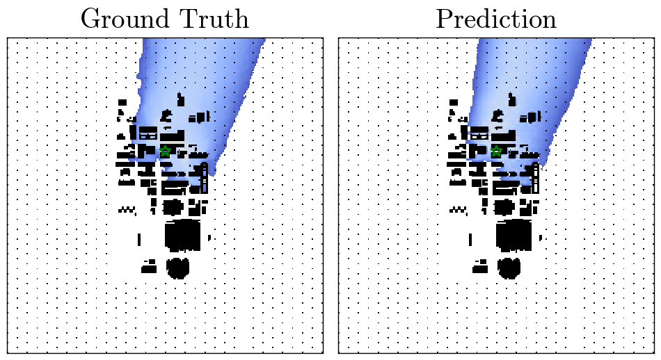
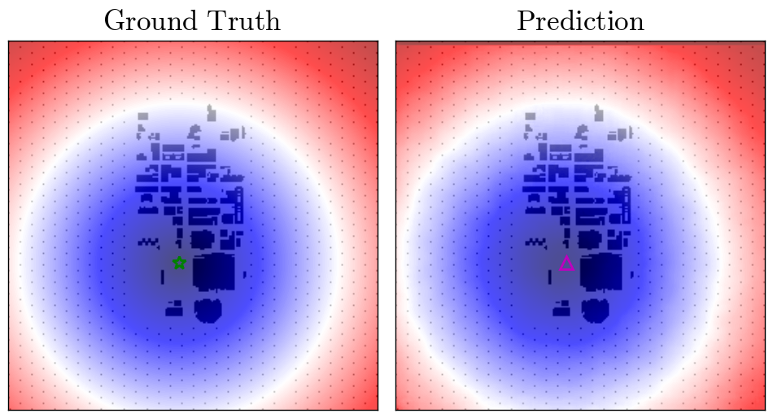

# CityTransformer

_CityTransformer_ is designed to predict the plume concentrations in the urban area under uniform flow condition.
It has two distinct input layers: Transformer layers for time series data and convolutional layers for image-like data.
The inputs of the network are realistically available data such as the the building shapes and source locations and time series monitoring data at a few observation stations. 

This network can be used to predict the plume concentration and source location (inverse problem). Following table summarizes the choice of input and output data for each task. The examples of predictions are also shown.

| Task | Input data | Output data | Example | 
| --- | --- | --- | --- |
| Plume prediction | 1. Monitoring time series data <br> 2. Levelset of bulidings <br> 3. Distance function of sources | 1. Plume concentration <br> 2. Binary representation of plume |  |
| Source detection | 1. Monitoring time series data <br> 2. Levelset of bulidings | 1. distance function of sources |  |

# Usage

## Installation
This code relies on the following packages. As a deeplearing framework, we use [PyTorch](https://pytorch.org).
- Install Python libraries
[numpy](https://numpy.org), [PyTorch](https://pytorch.org), [xarray](http://xarray.pydata.org/en/stable/), [horovod](https://github.com/horovod/horovod) and [netcdf4](https://github.com/Unidata/netcdf4-python)

- Clone this repo  
```git clone https://github.com/yasahi-hpc/CityTransformer.git```

## Prepare dataset
The urban plume dispersion dataset for CityTransformer has been computed by the [CityLBM](https://doi.org/10.1007/s10546-020-00594-x) code. The dataset can be downloaded from [Dataset (in preparation)](). We simulate a 4km x 4km x 2.5km area of Oklahoma city under the uniform flow conditions. In each simulation, 25 tracer particles are released from random locations in the city center. We consider three distinct 1.5 hour long time windows for data augumentation. A single file `shot#.nc` includes the two dimensional levelset function, two dimensional distance function from a source location, time-averaged two dimensional plume concentration on the ground, and its binary representation as image-like data. In addition, each file includes the time-varying vertical profiles of , ,  and  from 14 monitoring stations. The data is stored in the following format. In addition, we provide the precomputed normalization coefficients in a netcdf file, `stats.nc`.
```
<xarray.Dataset>
Dimensions:                         (station: 14, time: 60, z: 300, y: 256, x: 256, positions: 3)
Coordinates:
  * station                         (station) int64 0 1 2 3 4 ... 9 10 11 12 13
  * time                            (time) datetime64[ns] 2003-07-16T12:00:00...
  * x                               (x) float64 -1.024e+03 ... 1.024e+03
  * y                               (y) float64 -1.024e+03 ... 1.024e+03
  * z                               (z) float32 1.0 3.0 5.0 ... 597.0 599.0
  * positions                       (positions) int64 0 1 2
Data variables:
    u                               (station, time, z) float32 ...
    v                               (station, time, z) float32 ...
    scalar                          (station, time, z) float32 ...
    log_scalar                      (station, time, z) float32 ...
    release_point                   (y, x) float64 ...
    sdf                             (y, x) float32 ...
    zeros_map                       (y, x) float64 ...
    log_concentration_multi_digits  (y, x) float32 ...
    station_position                (station, positions) float64 ...
```

Once you download the dataset, one should create a dataset directory `<path_to_dataset_directory>`, wherein the training, valdiation and testdata are placed in the following manner.

```
---/
 |
 |--train/
 |  |--shot000000.nc
 |  |--shot000001.nc
 |  |--...
 |
 |--val/
 |  |--shot000000.nc
 |  |--shot000001.nc
 |  |--...
 |
 |--test/
    |--shot000000.nc
    |--shot000001.nc
    |--...
```


## Training
For training, it is recommended to use multiple Nvidia GPUs (12 GB memory or larger). 
We have trained the moel on [Nvidia V100](https://images.nvidia.com/content/volta-architecture/pdf/volta-architecture-whitepaper.pdf) GPUs.  
For the CNN architecture, we have prepared `Res-Net` and `U-Net` architectures. `Transformer` and `MLP` layers are available to encode time series data. 
The model can be set by the command line arguments.


## Inference and postscript
For inference, one should basically add `--inference_mode` to the command line arguments. In the default, the model state stored in the last checkpoint file is loaded, but you can also specify the checkpoint file for example by `--checkpoint_idx 5`.

# Citations
```bibtex
@article{OnoderaBLM2021,
    title = {{Real-time tracer dispersion simulation in Oklahoma City using locally-mesh refined lattice Boltzmann method}},
    year = {2021},
    journal = {Boundary-Layer Meteorology},
    author = {Onodera, Naoyuki and Idomura, Yasuhiro and Hasegawa, Yuta and Nakayama, Hiromasa and Shimokawabe, Takashi and Aoki, Takayuki},
    publisher = {Springer Netherlands},
    doi = {10.1007/s10546-020-00594-x},
    issn = {1573-1472},
    keywords = {Adaptive mesh refinement, Large-eddy simulation, Lattice Boltzmann method}
}
```

```bibtex
@article{OnoderaMEJ2020,
  title={Locally mesh-refined lattice Boltzmann method for fuel debris air cooling analysis on GPU supercomputer},
  author={Naoyuki ONODERA and Yasuhiro IDOMURA and Shinichiro UESAWA and Susumu YAMASHITA and Hiroyuki YOSHIDA},
  journal={Mechanical Engineering Journal},
  volume={7},
  number={3},
  pages={19-00531-19-00531},
  year={2020},
  doi={10.1299/mej.19-00531}
}
```

```bibtex
@article{OnoderaICONE2018,
    author = {Onodera, Naoyuki and Idomura, Yasuhiro},
    title = "{Acceleration of Plume Dispersion Simulation Using Locally Mesh-Refined Lattice Boltzmann Method}",
    volume = {Volume 8: Computational Fluid Dynamics (CFD); Nuclear Education and Public Acceptance},
    series = {International Conference on Nuclear Engineering},
    year = {2018},
    month = {07},
    doi = {10.1115/ICONE26-82145},
    url = {https://doi.org/10.1115/ICONE26-82145},
    note = {V008T09A034},
    eprint = {https://asmedigitalcollection.asme.org/ICONE/proceedings-pdf/ICONE26/51524/V008T09A034/2457794/v008t09a034-icone26-82145.pdf},
}
```

```bibtex
@article{OnoderaScalA2018,
    title = {{Communication Reduced Multi-time-step Algorithm for Real-time Wind Simulation on GPU-based Supercomputers}},
    year = {2018},
    journal = {2018 IEEE/ACM 9th Workshop on Latest Advances in Scalable Algorithms for Large-Scale Systems (ScalA)},
    author = {Onodera, Naoyuki and Idomura, Yasuhiro and Ali, Yussuf and Shimokawabe, Takashi},
    pages = {9--16},
    isbn = {9781728101767}
}
```
